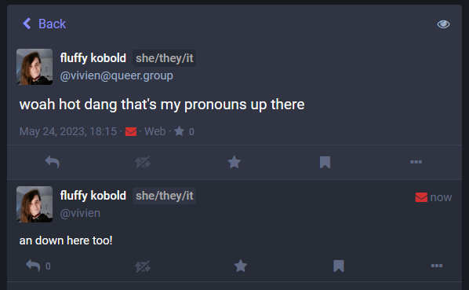

# ProToots (v0.99)
A Firefox extension which displays an author's pronouns next to their name on Mastodon.

## Download/Installation
### ⚠️ This is a **pre-release, temporary extension**! It will be **removed when you restart your browser**! ⚠️
ℹ️ We're working on a proper firefox store release already.  

To install go to [the releases page](https://github.com/ItsVipra/ProToots/releases) and follow the instructions there.

## FAQ
Why does it need permission for all websites?

> The addon needs to determine whether or not the site you are currently browsing is a Mastodon server. For that to work, it requires access to all sites. Otherwise, each existing Mastodon server would have to be explicitly added.

 ## setup
 - install web-ext with `npm install --global web-ext`
 - optionally:
    - run `web-ext run --firefox-profile='$ProfileNameOfYourChoosing' --profile-create-if-mising`
    - open that profile in firefox, log into fedi
    - after that when you run `web-ext run -p='$ProfileNameOfYourChoosing'` you should be logged into your fedi account
- run the extension with `web-ext run -u -u="yourinstancehere"`
