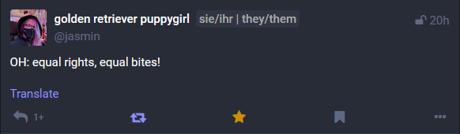

# ProToots (v1.1.2)

A Firefox extension which displays an author's pronouns next to their name on Mastodon. (Now in even more places!)

---

## Download/Installation

The extension is available on the firefox store! (we're working on chrome)

Alternatively you can download an unsigned version from the [releases page](https://github.com/ItsVipra/Protoots/releases).

---

## Known issues

- None! It's perfect!

Please also take a look at the FAQ below and the [issue list](https://github.com/ItsVipra/ProToots/issues).

---

## FAQ

### Why does ProToots need permission for all websites?

> The addon needs to determine whether or not the site you are currently browsing is a Mastodon server. For that to work, it requires access to all sites. Otherwise, each existing Mastodon server would have to be explicitly added.

### Why can't I see any ProPlates?

> It is likely your instance is not supported. This is because forks of Mastodon all work slightly differently and we cannot account for every version out there.  
> If ProToots isn't working on your instance please tell your admins to contact us here on Github.

### ProPlates don't have a background/low contrast on my instance.

> Mastodon does not provide set variables for element colors, so we have to adjust the plate styling to each theme. If they're not displaying correctly please tell your admins to [follow these steps to style ProPlates](#how-do-i-style-proplates-to-correctly-display-on-my-themes).

### Somebody has added/changed pronouns, why is ProToots still showing no/their old pronouns?

> In order to strain your instance less pronouns are cached for 24h, so it might take up to a day to see this change reflected.  
> Alternatively you can simply hit the "Reset cache" button in the addon settings.

### Why does the ProPlate just show a link?

> When an author only provides their pronouns as a pronouns.page link we display that instead. In the future we'll be able to extract pronouns from the given link. (See [#7](https://github.com/ItsVipra/ProToots/issues/7))

---

## Instance admin info

### Protoots aren't working on my instance

> Currently ProToots only looks for specific classes and IDs. If your instance has changed the name of those, ProToots will not find them.  
> Especially the **parent div with id 'Mastodon'** is important, since without that no other code will run.  
> Please open an issue with your server name and info on which names you've changed, so we can add support for your instance.  
> We're also working on a way to more easily support many different types of fedi software, such as Misskey or Akkoma. See [#12](https://github.com/ItsVipra/ProToots/issues/12)

### How do I style ProPlates to correctly display on my themes?

> You can set their background-color and color attribute for each theme.  
> To do this simply add some CSS to your server. [Here's how.](https://fedi.tips/customising-your-mastodon-servers-appearance/)  
> See [our default styles](/src/styles/proplate.css) for reference.

---

## Developer setup

- Clone the repository
- Install the required dependencies using `npm install`
- Start the development workflow with `npm start`
- Build with `npm run package`
- Mess around with with [protoots.js](/src/content_scripts/protoots.js)
- Trans rights!
